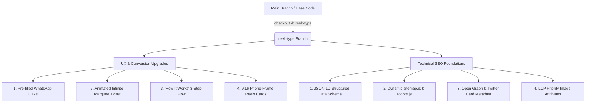

# Reelrr.in vs. HanumaDakshita Creators: Website & SEO Assessment

## Executive Summary

This assessment evaluates **[Reelrr.in](https://www.reelrr.in/)** — the reference website provided by the client — and provides an actionable blueprint for adapting its highest-performing design, user experience (UX), and SEO strategies into **HanumaDakshita Creators**.

Our findings show that while Reelrr excels at simple, high-velocity conversions through speed-focused copywriting and frictionless WhatsApp booking, our Next.js 16 App Router stack is technically superior. By incorporating Reelrr's visual and UX strengths into our existing codebase, we can deliver a website that fulfills the client's wishlist while achieving top Google rankings.

---

## 1. Why Reelrr.in Works: The Client Wishlist

Reelrr is structured as a **conversion-focused landing page** rather than a traditional portfolio. It addresses five critical psychological triggers for clients hiring social media creators:

### A. The "Same-Day Delivery" Speed Hook
- **Reelrr Approach:** Their headline and subheader lead with instant gratification: *"Your moment happens once. We make sure it's captured right, and before the day ends, it's already a reel you can share. Starting at ₹1,999."*
- **Why It Works:** Clients booking event creators (weddings, brand launches, parties, car deliveries) care most about **speed to social media** while the event is still trending.
- **Application for HanumaDakshita Creators:**
  - Update the homepage Hero subtext in `app/page.js` to prominently feature **"Instant & Same-Day Reel Delivery"**.
  - Provide a clear entry-level price point (e.g., *"Packages starting at ₹X"*) to reduce pricing friction.

### B. Frictionless WhatsApp Booking with Pre-Filled Messages
- **Reelrr Approach:** Instead of a generic contact form, every CTA button (`"Book Now"`) opens WhatsApp directly with a pre-populated message:
  ```
  https://wa.me/918878978966?text=Hey%2C%20I%20don't%20want%20to%20miss%20this%20moment.%20Let's%20book%20a%20shoot.
  ```
- **Why It Works:** It eliminates form-filling friction and gives potential clients an immediate conversation starter.
- **Application for HanumaDakshita Creators:**
  - Enhance all CTA buttons in `app/page.js` and `app/components/Navbar.js` with pre-filled WhatsApp text:
    ```
    https://wa.me/916267121751?text=Hi%20HanumaDakshita%20Creators%2C%20I'd%20like%20to%20book%20a%20reels%20shoot!
    ```

### C. Dynamic Infinite Marquee Ticker (Social Proof)
- **Reelrr Approach:** An angled, animated marquee banner runs continuously across the page with punchy value propositions:
  `Trained reelrrs only ✨ Shot on iPhone ✨ Book in minutes ✨ Always ready to shoot ✨ Ready before it ends`
- **Why It Works:** It creates visual dynamism, breaks up static content, and reinforces key brand promises without requiring long paragraphs.
- **Application for HanumaDakshita Creators:**
  - Implement a CSS-animated marquee ticker below the Hero section highlighting:
    `Same-Day Reels ✨ High-Impact Visuals ✨ 100+ Happy Clients ✨ Professional Editing ✨ Brand Storytelling`

### D. 3-Step "How It Works" Section
- **Reelrr Approach:** Their process is distilled into three effortless steps:
  1. **Book in Minutes** (Choose your date & location)
  2. **We Shoot** (Trained creators capture your event)
  3. **Same-Day Delivery** (Receive social-ready reels before the day ends)
- **Why It Works:** Demystifies the hiring process and builds trust.
- **Application for HanumaDakshita Creators:**
  - Add an interactive **"Our Process"** timeline section to the homepage.

### E. Vertical 9:16 Mobile-Frame Reels Showcase
- **Reelrr Approach:** Video samples are displayed inside vertical 9:16 phone-frame mockups (simulating an iPhone screen) rather than standard horizontal embeds.
- **Why It Works:** Matches the native format of Instagram Reels and YouTube Shorts, helping clients visualize exactly what their final product will look like on a phone.
- **Application for HanumaDakshita Creators:**
  - Upgrade the Portfolio section in `app/page.js` to display sample reels inside stylish mobile card frames with play/pause hover effects.

---

## 2. Feature Comparison: Reelrr.in vs. HanumaDakshita Creators

| Feature / Metric | Reelrr.in (Client Reference) | HanumaDakshita Creators (Current) | Recommended Action |
| :--- | :--- | :--- | :--- |
| **Tech Stack** | Next.js / Tailwind CSS | **Next.js 16 App Router / Tailwind v4** | Maintain current stack (superior SSR & React 19 performance). |
| **Primary Value Prop** | Same-day reel delivery starting at ₹1,999 | Creating Stories • Building Brands | **Combine both:** Keep brand storytelling + add "Same-Day Delivery" badge. |
| **Conversion CTA** | Pre-filled WhatsApp chat link | Standard WhatsApp link (`wa.me/916267121751`) | **Upgrade CTA:** Add custom URL-encoded pre-filled message text. |
| **Social Proof Ticker** | Angled marquee banner | Static client count banner | **Add Marquee:** Implement an infinite CSS scrolling ribbon. |
| **Portfolio Display** | 9:16 vertical phone mockups | Category cards with hover gradients | **Add Vertical Frames:** Add mobile-frame video previews. |
| **Process Section** | Clean 3-step workflow | Not currently featured on homepage | **Add Process Flow:** Add a 3-step booking timeline section. |
| **Structured Schema** | `LocalBusiness` (Indore) | Not yet implemented | **Implement Schema:** Add comprehensive `ProfessionalService` + `LocalBusiness` JSON-LD. |

---

## 3. SEO Strategy: How We Outrank Reelrr.in on Google

Reelrr currently ranks well for local queries in Indore due to its targeted metadata and local schema. Here is how we will outperform them across search engines:

### A. Dual-Entity JSON-LD Structured Data
We will implement an advanced JSON-LD schema in `app/layout.js` that registers HanumaDakshita Creators as both a **`ProfessionalService`** and a **`LocalBusiness`**, explicitly mapping out all four core services:

```json
{
  "@context": "https://schema.org",
  "@type": "ProfessionalService",
  "name": "HanumaDakshita Creators",
  "url": "https://yourdomain.com",
  "telephone": "+916267121751",
  "email": "hanumadakshitacreators@gmail.com",
  "description": "Premier social media management and creative content agency specializing in Instagram Reels, Photography, Graphic Designing, and Brand Growth.",
  "priceRange": "₹₹",
  "address": {
    "@type": "PostalAddress",
    "addressCountry": "IN"
  },
  "hasOfferCatalog": {
    "@type": "OfferCatalog",
    "name": "Creative Agency Services",
    "itemListElement": [
      {
        "@type": "Offer",
        "itemOffered": {
          "@type": "Service",
          "name": "Instagram Reels & Video Production"
        }
      },
      {
        "@type": "Offer",
        "itemOffered": {
          "@type": "Service",
          "name": "Social Media Management (SMM)"
        }
      },
      {
        "@type": "Offer",
        "itemOffered": {
          "@type": "Service",
          "name": "Professional Photography"
        }
      },
      {
        "@type": "Offer",
        "itemOffered": {
          "@type": "Service",
          "name": "Graphic Designing & Branding"
        }
      }
    ]
  }
}
```

### B. Broader & High-Intent Keyword Strategy
While Reelrr focuses almost exclusively on event videography keywords (`same-day reels`, `wedding reels`), HanumaDakshita Creators will capture **both** event clients and monthly retainer clients by targeting two search intent pillars:
1. **Event & Instant Visuals (High Velocity):**
   - *Keywords:* `"Same day reels creator [City]"*, *"Wedding reel creators near me"*, *"Event reel videographer"*.
2. **Agency & Retainer Services (High Value):**
   - *Keywords:* *"Social Media Management Agency"*, *"Instagram growth agency India"*, *"Brand storytelling & graphic design agency"*.

### C. Technical SEO Checklist for Launch
- **`app/sitemap.js`:** Dynamic XML sitemap generator ensuring immediate crawler indexing.
- **`app/robots.js`:** Clean crawler directives pointing to the XML sitemap.
- **Open Graph & Twitter Cards:** Eye-catching 1200x630px preview banners when links are shared on WhatsApp, LinkedIn, and Instagram.
- **LCP Optimization:** Add the `priority` attribute to Above-the-Fold hero images in `app/page.js` to score 100 on Google Core Web Vitals.

---

## 4. Proposed Implementation Architecture



---

## 5. Next Steps

1. **Review Assessment:** Review the UX enhancements and SEO strategy outlined above.
2. **Prioritize Components:** Select whether to implement the **visual conversion features** (Marquee ticker, WhatsApp CTA prompts, 3-Step Process) first or the **SEO foundation** (sitemap, robots, schema).
3. **Commit & Deploy:** Commit the changes to the `reelr-type` branch for client demonstration.
